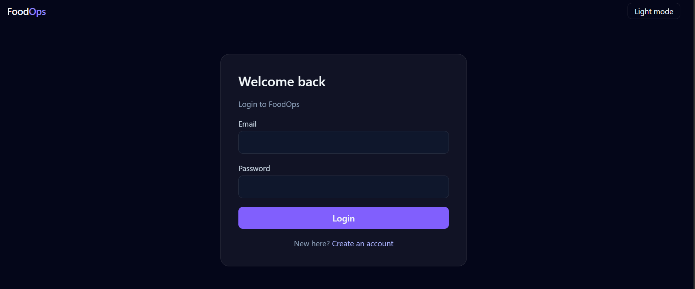
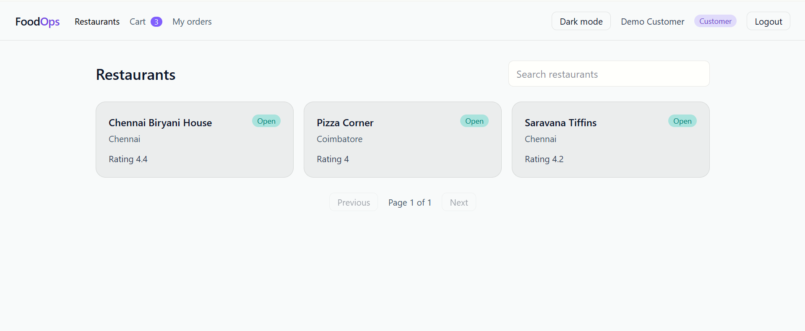
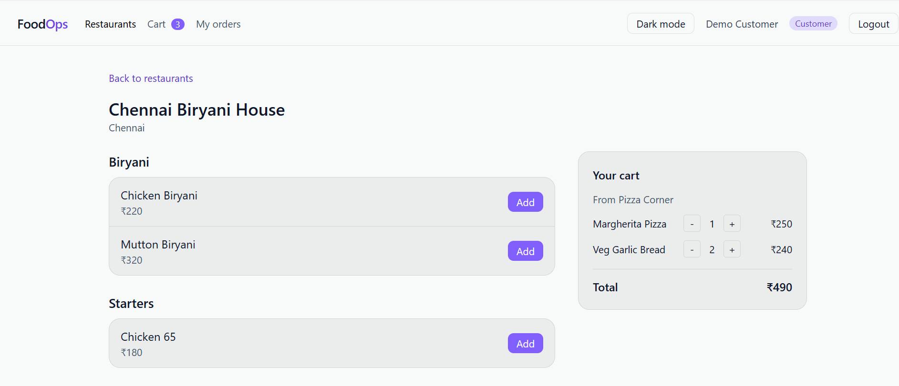
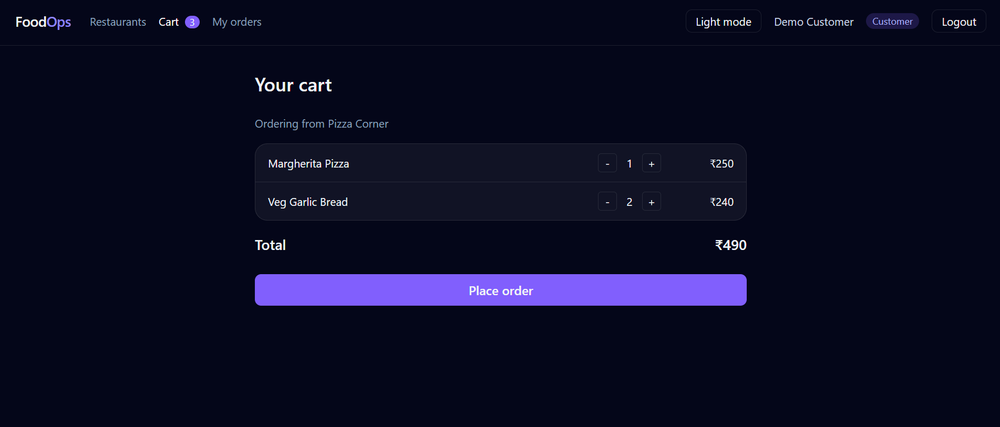
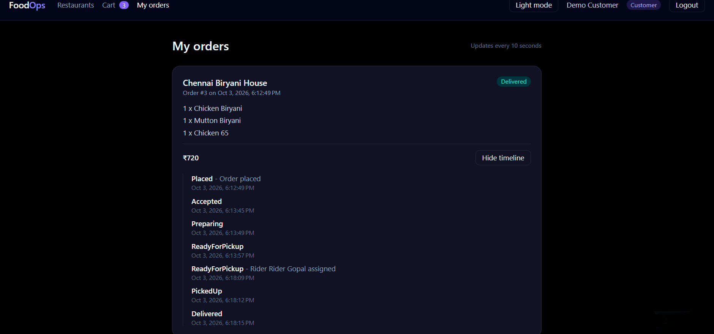
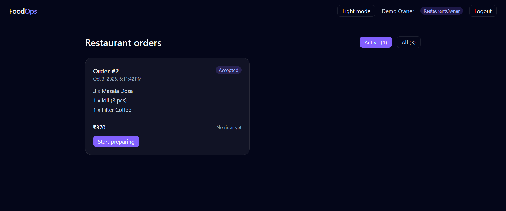
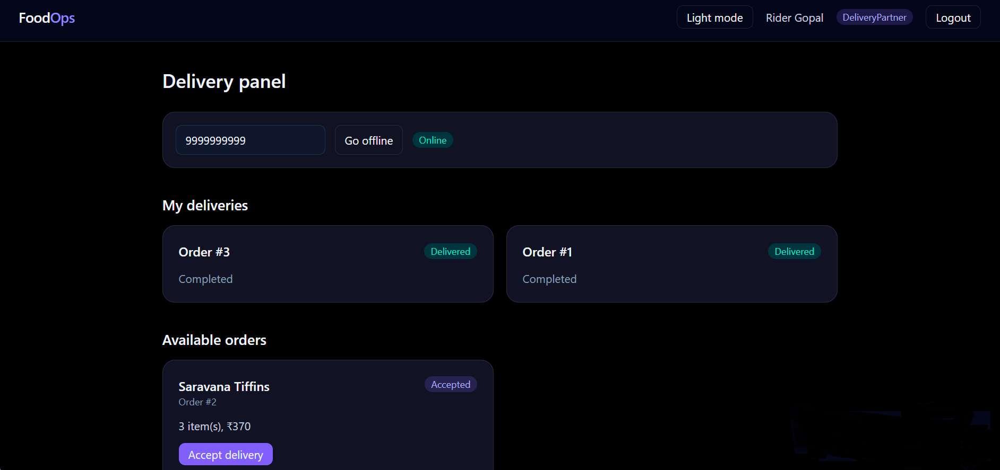
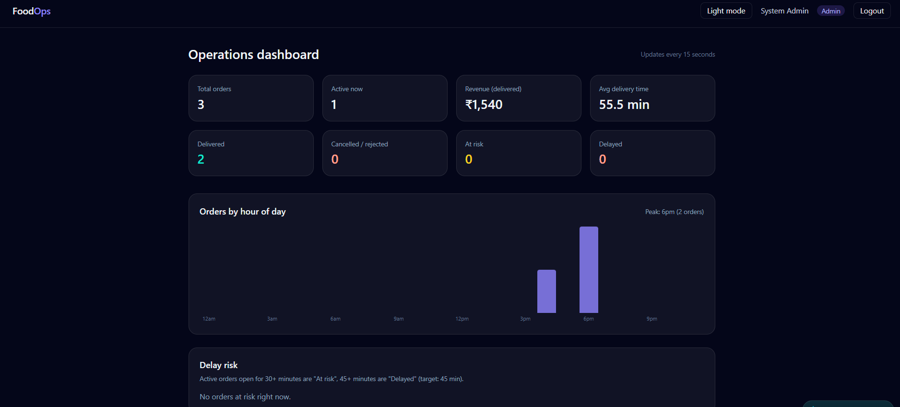
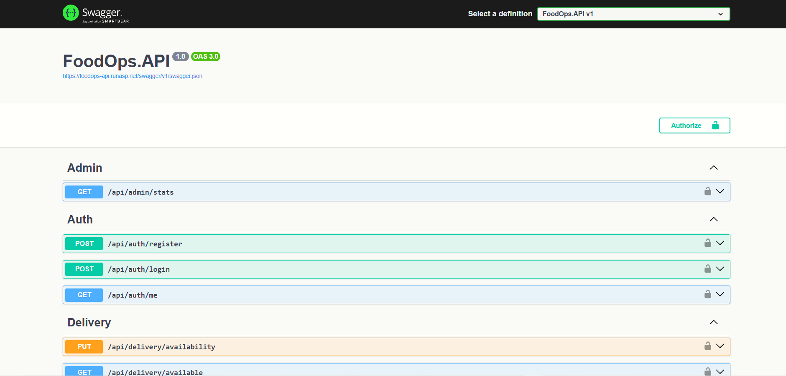

# FoodOps: Food Delivery Operations Platform

A full-stack food delivery operations app with four role-based workflows (customer, restaurant owner, delivery rider, admin), built with **ASP.NET Core 8 Web API** (Clean Architecture) and **Angular 20**.

**Live demo:** https://foodops-gokul.netlify.app
**API (Swagger):** https://foodops-api.runasp.net/swagger

> The API runs on a free hosting plan, so the first request after a period of inactivity can take 20 to 30 seconds.

## Demo accounts

| Role | Email | Password |
|---|---|---|
| Admin | admin@foodops.com | Admin@123 |
| Restaurant owner | owner@foodops.com | Owner@123 |
| Customer / Rider | Register a new account from the login page | |

These are demo accounts with sample data only. Please do not enter real personal information.

## Screenshots

| | |
|---|---|
|  |  |
|  |  |
|  |  |
|  |  |
|  | |

## Features

**Customer**
- Browse restaurants with debounced search and pagination
- Menu, cart and checkout (price is calculated on the server, never trusted from the client)
- My orders with live status updates (polling) and a status timeline

**Restaurant owner**
- Sees orders for their own restaurant and moves them through the allowed statuses

**Rider**
- Goes online, claims ready orders and completes deliveries
- Order claiming is atomic (`ExecuteUpdateAsync`), so two riders cannot take the same order

**Admin**
- Dashboard with platform statistics

**Platform**
- JWT authentication with ASP.NET Core Identity and role-based authorization
- Order status transition rules with an audit trail (`OrderStatusLogs`)
- Global exception-handling middleware and Serilog logging
- EF Core migrations applied and sample data seeded on startup
- Light and dark themes (saved in the browser)

## Tech stack

| Layer | Technology |
|---|---|
| API | ASP.NET Core 8 Web API, C# |
| Architecture | Clean Architecture (API / Application / Domain / Infrastructure) |
| Data | Entity Framework Core 8, SQL Server |
| Auth | ASP.NET Core Identity, JWT bearer tokens |
| Frontend | Angular 20 (standalone components, signals, reactive forms, lazy-loaded routes), RxJS |
| Styling | Tailwind CSS v4 |
| Hosting | Netlify (frontend), MonsterASP.NET (API and SQL Server) |

## Architecture

```
Angular (Netlify)  --HTTPS/JSON-->  ASP.NET Core API (MonsterASP)  -->  SQL Server

FoodOps.API             Controllers, middleware, DI, Swagger
FoodOps.Application     DTOs, service interfaces, business rules
FoodOps.Domain          Entities and enums (no dependencies)
FoodOps.Infrastructure  EF Core DbContext, migrations, Identity, service implementations, seeding
```

Design decisions worth noting:
- DTOs are used for all API input and output, so entities are never exposed.
- `DeleteBehavior.Restrict` on selected relationships avoids SQL Server "multiple cascade paths" errors and protects order history.
- Allowed order status transitions are enforced in the service layer, and every change is logged.
- CORS origins and secrets come from configuration; production secrets are not stored in the repository.

## API overview

The API is grouped into Auth, Restaurants, Menu, Orders, Delivery and Admin controllers. See the full list with request and response models in Swagger: https://foodops-api.runasp.net/swagger

## Run locally

Prerequisites: .NET 8 SDK, Node.js 22+ or 24, SQL Server (LocalDB or Express).

```bash
git clone https://github.com/Gokulram124/FoodOps.git
cd FoodOps
```

**API**
1. Set `ConnectionStrings:DefaultConnection` and `Jwt:Key` in `FoodOps.API/appsettings.json` (or user secrets).
2. Run the `https` profile (https://localhost:7197). The database is created and seeded automatically on first start.

**Client**
```bash
cd client
npm install
ng serve
```
Open http://localhost:4200.

## Known limitations and planned improvements

Not implemented yet (planned):
- Real-time updates with SignalR (the app currently polls)
- Refresh tokens
- Caching and background jobs
- Docker support and a CI/CD pipeline
- Automated tests
- The rider page does not remember its online status after a page refresh

## Author

**Gokulram P**, .NET developer, Chennai
GitHub: https://github.com/Gokulram124